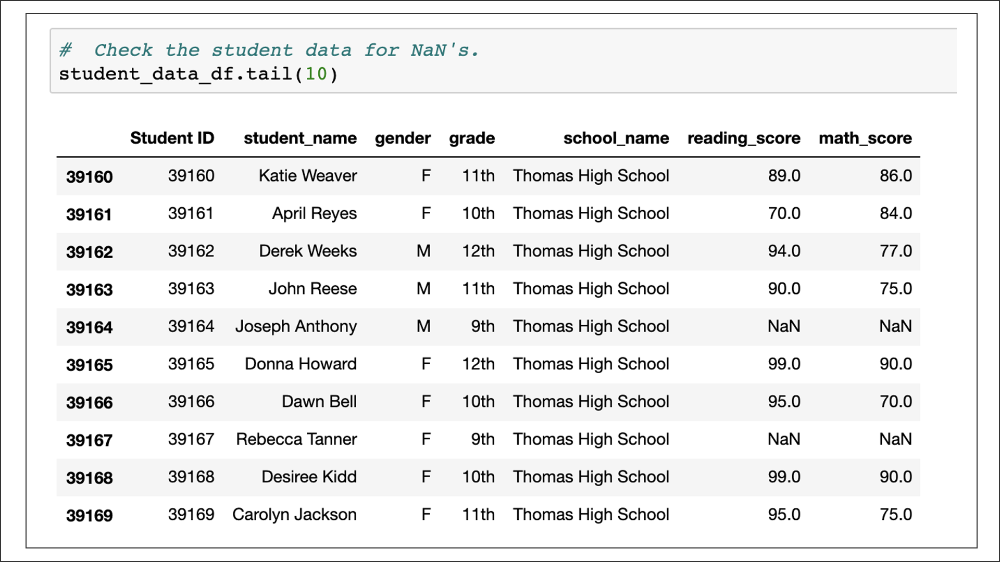
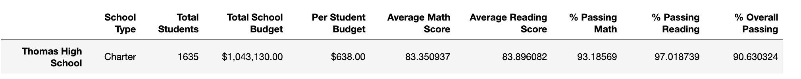

# School_District_Analysis

## Project Overview

Create the district summary Dataframe.
Create the  summary Dataframe.
Calculate the average  score received by students in each grade level at each .
Calculate the average  score received by students in each grade level at each .
Calculate the  performance based on the spending per student.
Calculate the  performance based on the size of the .
Calculate the  performance based on the type of .

# Resources
Data Source : schools_complete.csv , students_complete.csv
Tools : , Pandas, Jupyter Notebook

# Summary of Analysis

  ## How is the district summary affected?

The normal score dropped by < 1% 

The normal score was not influenced 

The rate passing dropped by 1% 

The rate passing dropped by 1% 

The general passing rate dropped by 1%

  ## How is the  summary affected?

The Per outline was just influenced for Thomas : 

rate passing dropped from 93.2% to 66.9% 

rate passing dropped from 97.3% to 69.7% 

generally speaking passing rate dropped from 90.9% to 65.1%

  ## How were the  rankings affected?

Thomas exited the Top 5 moving Wright into the main 5 

The Bottom 5 schools continued as before

  ## How were the other reports affected?

- Scores by Grade continued as before aside from Thomas which revealed had no information to report 

- Scores by Spending changed at the $630-644 territory: - rate passing dropped from 73% to 67% - rate passing dropped from 84% to 77% - in general passing rate dropped from 63% to 56% 

- Scores by Size changed at the Medium(1000-2000) size: - rate passing dropped from 94% to 88% - rate passing dropped from 97% to 91% - by and large passing rate dropped from 91% to 85% 

- Scores by Type changed by Charter type: - rate passing dropped from 94% to 90% - rate passing dropped from 97% to 93% - by and large passing rate dropped from 90% to 87%
## Results 

   
   
   
   
